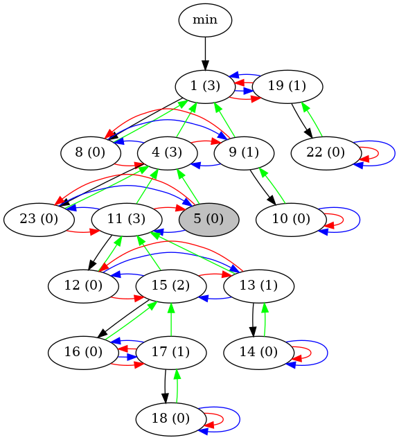

# Fibonacci Heap

Implementation of a Fibonacci Heap in C++ guided by the [Introduction to Algorithms](https://mitpress.mit.edu/books/introduction-algorithms-third-edition) book by Cormen, Leiserson, Rivest and Stein.

## Usage

The Fibonacci Heap is implemented in the `FibonacciHeap.hpp` header file. It is templated on the type of the elements it stores. The Fibonacci Heap is a min-heap, i.e. the element with the smallest key is always at the top. The Fibonacci Heap supports the following operations:

* `insert(key)`: Inserts a new element with the given key into the heap.
* `unite(other_heap)`: Unites the heap with the given heap. The other heap is empty afterwards.
* `getMin()`: Returns the smallest key in the heap.
* `extractMin()`: Returns the smallest key in the heap and removes it from the heap.
* `decreaseKey(element, new_key)`: Decreases the key of the given element to the new key. The new key must be smaller than the old key.
* `deleteElement(element)`: Deletes the given element from the heap.
* `isEmpty()`: Returns whether the heap is empty.

The Fibonacci Heap is implemented as a class template. To use it, you have to include the header file and instantiate the template with the type of the elements you want to store in the heap.

## Visualization

The fibonacci heap can be visualized using the inherited class `FibonacciHeapViz`. The visualization is done using the [GraphViz](https://www.graphviz.org/) library. The visualization is done in the `dot` format. The visualization is done by dumping the current state of the heap to the given `std::ostream:`, which can be a file or the standard output. The following operation is added to the Fibonacci Heap:

* `exportDot(ostream)`: Exports the current state of the heap to the given `std::ostream`.

## Example

Refer to the `main.cpp` file for an example of how to use the Fibonacci Heap with the visualization:  

